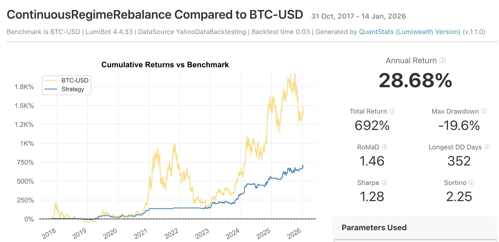

# Lumibot Backtests

This Python application demonstrates how a developer would consume your API to build a sophisticated, regime-aware trading bot using Lumibot.

The script fetches the last 3000 days of data from your endpoint, prepares it for the Lumibot backtester, and provides several strategy templates that leverage the market_regime_score to filter signals and manage risk.



## Context-Aware Logic:

- Continuous Re-balancing strategy, based on the current market regime score

## Extensibility 
The commented-out strategies provide a "Playground" to explore the value of the API and AI detected market regime.


## DataSource
https://defitheodds.xyz

## Requirements

### Ensure uv is installed
```curl -LsSf https://astral.sh/uv/install.sh | sh ```
or
```pip install uv```
ensure uv installed
```uv --version```

### Create env
```uv venv```
```source .venv/bin/activate```

### Install reqs
```uv pip install -r requirements.txt```

### define your API key
Get your free API key from https://defitheodds.xyz

```export DEFI_API_KEY='your_key_here'```

### Run app
```python main.py```

